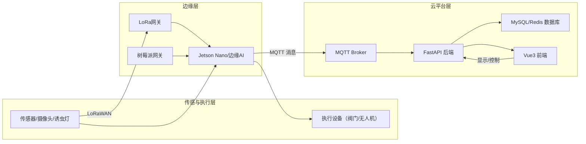
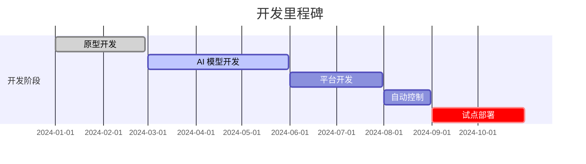

```markdown
# 天衍·生境（EcoNexus）项目说明

**执行摘要：** 本项目旨在构建一套基于物联网（IoT）、边缘AI和数字孪生的智慧农业平台，整合传感器感知、AI视觉和自动化控制等技术，实现农业生产过程的智能化管理。平台提供病虫害识别、精准灌溉、多模态环境监测与风险预警等功能，支持“云-边-端”协同工作，即使网络中断时也能在边缘设备独立运行。核心技术包括 Ultralytics YOLOv8 目标检测、SAHI 切片推理、Jetson 边缘AI推理、FastAPI 后端服务、Vue3 前端框架，以及 LoRaWAN 和 MQTT 等通信协议。

## 项目简介

天衍·生境（EcoNexus）是一套面向现代智慧农业的数字化解决方案，覆盖农田环境感知、病虫害监测、农业生产决策等全流程。系统通过部署土壤、水质、气象传感器和高清摄像头等设备实时采集环境数据，并通过低功耗广域网（如 LoRaWAN）远距离传输【7†L573-L580】。边缘层采用 NVIDIA Jetson 等嵌入式平台进行本地 AI 推理和控制策略执行【33†L78-L81】；云平台层则使用 FastAPI 等构建后端服务，存储数据并进行大规模 AI 分析和数字孪生建模【35†L324-L325】。前端使用 Vue3 框架进行可视化展示和交互，使用户能够实时查看农田状态、预测结果和控制指令。系统通信可同时支持 MQTT、HTTP/REST 等协议，实现边缘与云端的数据交互【23†L44-L46】【7†L573-L580】。

## 项目目标

- **数字化监测**：全面感知农田环境信息（如土壤湿度、养分、水质、气象和虫情图像等）。  
- **智能识别**：利用计算机视觉和 AI 算法实现虫害图像自动识别和定位。  
- **精准灌溉**：根据土壤水分和蒸散发模型等数据，动态调整灌溉方案，减少水资源浪费。  
- **自动化执行**：对接无人机、滴灌阀门等执行设备，实现感知-决策-执行的闭环控制，降低人工干预。  
- **可扩展部署**：平台设计支持离线运行和模块化扩展，可部署在农场、农业合作社等多种环境。

## 核心功能

- **病虫害智能识别**：采用 Ultralytics YOLOv8 模型（在精度和速度上具有业界领先性能【3†L74-L80】）结合 SAHI 切片推理技术【29†L47-L54】进行害虫检测。通过安装诱虫灯和高清相机，边缘设备实时获取虫害图像并推理识别常见害虫（如稻飞虱、蚜虫等），记录虫害种类和位置，生成预警。  
- **智能灌溉系统**：根据土壤湿度、气象数据和作物需水模型（如 Penman-Monteith 蒸散发模型）自动计算灌溉需求。系统通过电磁阀和水泵对农田进行精准灌溉，灵活调节水量和时机，实现节水与增产。  
- **多模态环境监测**：实时收集并融合土壤传感器、气象站、水质分析仪和图像等多源数据，生成农田数字画像。利用时序预测和多模态 AI 算法（如 LSTM、XGBoost、Transformer 等）分析环境变化趋势，评估干旱、病虫害等风险，并及时发出预警。  
- **数字孪生决策系统**：在云端构建农田数字孪生模型，通过 AI 预测和模拟分析，生成农田热力图、病虫害风险图和精准施药灌溉方案。决策系统支持参数调优和策略模拟，帮助用户制定科学的田间管理方案。  
- **自动化控制**：系统对接农业执行单元，包括自动化水泵阀门、喷灌无人机和边缘执行模块等。支持 MQTT、LoRaWAN、Modbus、HTTP 等协议实现远程控制。当监测到异常时，可自动启动针对性的作业（如滴灌、喷药），形成完整的感知→分析→决策→执行闭环【23†L44-L46】【7†L573-L580】。  

## 技术架构

系统采用“云-边-端”三层架构：  

- **感知层**：部署土壤湿度传感器、水质传感器、气象站、诱虫灯和摄像头等设备，实时采集农田环境和虫害数据。通过 LoRaWAN、Modbus 等协议将数据传输至边缘层，确保远距离覆盖和低功耗通信【7†L573-L580】。  
- **边缘层**：使用 NVIDIA Jetson Nano/Xavier、树莓派等边缘计算节点进行本地 AI 推理和实时控制。边缘设备通过 TensorRT 优化的模型加速推理【11†L10-L13】；同时能在网络异常时独立运行识别和控制逻辑，提高系统可靠性【33†L78-L81】。  
- **云平台层**：基于 Python/FastAPI 构建后端服务和数据库（MySQL/Redis），负责大规模数据存储、AI分析和决策生成【35†L324-L325】。云端还提供数字孪生模拟和风险预测功能，并通过 Web/API 将结果展示给用户。  

下图展示了系统的技术架构：  



## 技术栈清单

- **前端**：Vue3（渐进式前端框架，易学易用且性能出色【20†L81-L85】）、TypeScript、Element Plus、ECharts、Axios 等。  
- **后端**：Python 3.10+、FastAPI（现代高性能 Web 框架【35†L324-L325】）、Flask、SQLAlchemy、MySQL、Redis、MQTT Broker 等。  
- **AI算法**：PyTorch（GPU/CPU优化的深度学习库【26†L47-L50】）、Ultralytics YOLOv8【3†L74-L80】、OpenCV、TensorRT（高性能推理加速库【11†L10-L13】）、ONNX（开放神经网络交换格式【9†L152-L158】）、SAHI（图像切片推理库【29†L47-L54】）等。  
- **边缘设备**：NVIDIA Jetson Nano/Xavier（边缘AI平台）、Raspberry Pi（网关）、Ubuntu 系统。  
- **通信协议**：LoRaWAN（全球LPWAN标准【7†L573-L580】）、MQTT（轻量级物联网消息协议【23†L44-L46】）、Modbus、HTTP/REST 等。  

## 项目目录结构

```text
EcoNexus/
│
├── backend/            # 后端服务（FastAPI）
│   ├── api/            # API 路由
│   ├── models/         # 数据模型与 ORM
│   ├── services/       # 业务逻辑
│   ├── database/       # 数据库初始化脚本
│   └── main.py         # FastAPI 应用入口
│
├── frontend/           # 前端应用（Vue3）
│   ├── src/
│   ├── views/
│   ├── components/
│   └── router/
│
├── ai/                 # AI模型与训练代码
│   ├── datasets/      # 数据集与标注
│   ├── train/         # 训练脚本
│   ├── weights/       # 模型权重
│   └── inference/     # 推理脚本
│
├── edge/               # 边缘设备代码
│   ├── jetson/        # Jetson板端
│   ├── lora/          # LoRa通信
│   └── mqtt/          # MQTT 客户端
│
├── hardware/           # 硬件驱动与电路
│   ├── sensors/       # 传感器接口
│   ├── valve/         # 电磁阀控制
│   └── drone/         # 无人机集成
│
├── docs/               # 文档
├── docker/             # Docker 配置
└── README.md           # 本文件
```

## 安装与部署

- **环境要求**：Python ≥ 3.10，Node.js（推荐 v14+），Docker 与 Docker Compose（选用）。  
- **后端部署（本地）**：  
  ```bash
  cd backend
  pip install -r requirements.txt   # 安装 Python 依赖
  # 配置数据库连接（环境变量或配置文件）
  uvicorn main:app --reload        # 启动 FastAPI 服务
  ```  
- **前端部署（本地）**：  
  ```bash
  cd frontend
  npm install      # 安装前端依赖
  npm run dev      # 启动 Vue3 本地开发服务器
  ```  
- **Docker 部署**：项目提供 Docker 配置，可使用 Docker Compose 一键部署：  
  ```bash
  docker-compose up -d
  ```  
  这将在容器中运行后端、前端和数据库服务。

- **示例 API 启动**：启动后端后，可访问 `http://localhost:8000/docs` 查看自动生成的接口文档。更多示例请参考 `backend/README.md` 或相应文档。

## 边缘设备部署要点

在边缘节点（如 Jetson Nano）上预装 Ubuntu 和 NVIDIA JetPack，以支持 TensorRT 推理。将训练生成的 TensorRT 模型文件复制至边缘设备，使用 NVIDIA TensorRT SDK 加载并运行模型【11†L10-L13】。通过 LoRaWAN 或有线方式接入传感器（如 485 总线或 I2C），并配置 MQTT 客户端用于消息传输。在断网情况下，边缘设备可独立运行 YOLOv8 模型进行图像推理，实现本地预警和执行控制【33†L78-L81】【7†L573-L580】。同时，可通过边缘服务周期性地与云端同步数据或接收远程指令，以更新策略或模型。

## AI 模型训练与部署流程

1. **数据集准备**：收集农业虫害和作物生长的图像数据（可使用诱虫灯采集稻田虫害图像），并使用标注工具标记目标框。必要时对图像进行数据增强，以提高对小目标的检测鲁棒性。  
2. **YOLOv8 模型训练**：基于 PyTorch 框架【26†L47-L50】使用 Ultralytics YOLOv8 进行训练。示例命令：  
   ```bash
   yolo train model=yolov8n.yaml data=pests.yaml epochs=50
   ```  
   其中 `pests.yaml` 定义了虫害数据集路径和类别。训练完成后会生成最优权重模型 `best.pt`。  
3. **模型导出与量化**：将训练好的模型导出为 ONNX 格式【9†L152-L158】，方便跨平台部署。可使用 Ultralytics 提供的导出命令：  
   ```bash
   yolo export model=best.pt format=onnx
   ```  
   得到 `best.onnx` 文件。随后使用 NVIDIA TensorRT 将 ONNX 模型转换为优化后的推理引擎（支持 FP16/INT8 量化）。示例命令：  
   ```bash
   trtexec --onnx=best.onnx --saveEngine=best.engine --fp16 --workspace=1024
   ```  
   这一步骤可显著提高推理速度【11†L10-L13】。  
4. **边缘部署**：将生成的 `.engine` 文件部署到 Jetson 边缘设备，使用 TensorRT 推理 SDK 加载模型进行实时检测。通过脚本或服务启动边缘推理程序，并订阅/发布 MQTT 消息以接收指令和上报结果。后续可通过云端接口下发新模型或阈值设置，实现模型迭代升级。

## 数据库表设计

| 表名           | 示例字段                           | 描述                 |
|--------------|----------------------------------|--------------------|
| user         | id, name, role                   | 用户信息             |
| sensor_data  | id, timestamp, soil_moisture, air_temp, humidity, ... | 传感器数据日志         |
| pest_record  | id, time, species, image_url    | 虫害检测结果记录       |
| irrigation_log| id, time, valve_status, volume  | 灌溉操作日志          |
| warning_log  | id, time, level, type, message  | 系统预警日志          |

## 开发路线与里程碑

下表和甘特图展示了项目的开发阶段和预期时间：  

| 阶段         | 时间范围         | 主要任务描述                    |
|------------|---------------|-----------------------------|
| 原型开发    | 2024-01 ~ 2024-02 | 传感器硬件接入、边缘与前端原型搭建       |
| AI 模型开发 | 2024-03 ~ 2024-05 | 虫害数据标注、YOLOv8 训练与部署        |
| 平台开发    | 2024-06 ~ 2024-07 | 多模态数据分析、风险预测与数字孪生开发   |
| 自动控制    | 2024-08 ~ 2024-08 | 精准灌溉功能、无人机喷药联动集成      |
| 试点部署    | 2024-09 ~ 2024-10 | 实地测试优化（示范农场或高校试点）    |



## 团队分工

- **AI 算法组**：负责深度学习模型的研发与优化（数据标注、YOLOv8训练、模型压缩量化等）。  
- **后端组**：负责 FastAPI 服务开发、数据库设计和 IoT 数据处理逻辑。  
- **前端组**：负责 Vue3 可视化平台和用户交互界面开发。  
- **硬件组**：负责传感器、LoRa网关和无人机等硬件选型、部署和集成。  
- **运维组**：负责部署和维护系统运行环境、监控日志与性能，以及环境安全性。  
- **农学专家**：提供农业生产、病虫害防治等领域专业知识支持，指导系统优化。

## 预算估算

| 预算项目        | 估算费用（元） |
|--------------|------------|
| Jetson 嵌入式主机 | 30,000     |
| 传感器与硬件    | 50,000     |
| 喷洒无人机与配件 | 20,000     |
| 云服务器/租赁   | 10,000     |
| 软件开发 (人力) | 80,000     |
| 系统测试与部署  | 30,000     |
| **合计**       | **200,000** |

*注：以上为初步估算，实际成本根据设备品牌和规模可有所调整。*

## 常见问题与维护指南

- **系统离线运行**：设计时已考虑边缘自主运行能力，边缘设备在断网时可缓存数据并独立完成识别与控制任务，待网络恢复后统一上传数据。  
- **模型更新**：建议定期收集新数据进行模型重训，更新后的模型通过云端 API 下发至边缘设备进行升级。  
- **数据备份与恢复**：定期备份数据库和配置，使用 Redis 缓存提高系统并发性能。遇到异常时可通过备份快速恢复服务。  
- **日志与监控**：配置系统监控和日志报警（如 Prometheus + Grafana），监测传感器通信状态、AI推理正确性和API可用性，及时发现故障。  
- **维护建议**：定期校准传感器，清理摄像头视野；更新系统补丁和依赖库以保证安全；检查 LoRa 连接质量和天线位置，确保稳定通信。

## License 与联系方式

- **许可协议**：本项目采用 MIT 开源许可证（详见 LICENSE 文件）。  
- **联系方式**：EcoNexus 团队，邮箱 `contact@econexus.ai`。如有合作意向或技术支持需求，请通过邮箱与我们联系。

```

请将以上内容复制并保存为文件 `README.md`，确保文件编码为 UTF-8，以便开发团队使用。